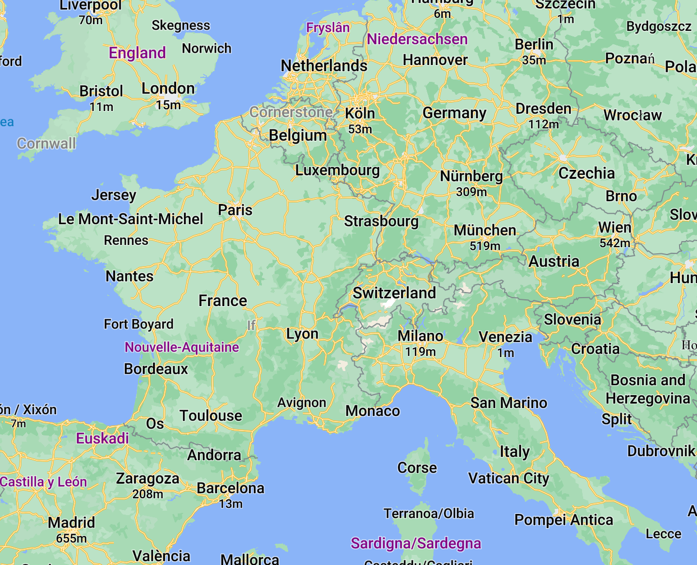

# double-resolution-cjk-maplibre
MapLibre GL JS with double resolution CJK

Uses pull request [#3006](https://github.com/maplibre/maplibre-gl-js/pull/3006) from Brandon Liu on doubling the CJK resolution in MapLibre GL JS.

To show users who are more familiar with latin text than CJK how big of an improvement this doubling is, I change maplibre-gl-js to render all letters including latin and greek in the way that it renders CJK letters.

For this, I simply changed this function in `glyph_manager.ts` to always return `true`:

```diff
     _doesCharSupportLocalGlyph(id: number): boolean {
+        return true;
         /* eslint-disable new-cap */
         return !!this.localIdeographFontFamily &&
             (unicodeBlockLookup['CJK Unified Ideographs'](id) ||
             unicodeBlockLookup['Hangul Syllables'](id) ||
             unicodeBlockLookup['Hiragana'](id) ||
             unicodeBlockLookup['Katakana'](id));
         /* eslint-enable new-cap */
     }
```

Have a look at how the map looks like at:

* Normal resolution (main): https://wipfli.github.io/double-resolution-cjk-maplibre/main#map=4.29/21.55/94.39
* Double resolution (#3006): https://wipfli.github.io/double-resolution-cjk-maplibre/double#map=4.29/21.55/94.39

To best see the difference, open `main.html` in one tab and then `double.html` in a second tab and copy-paste the location from one tab to the other and switch between tabs.

## Quadruple Resolution

Just for fun, I also added a demo which shows what would happen if we quadruple the resolution:

* Quadruple resolution: https://wipfli.github.io/double-resolution-cjk-maplibre/quadruple#map=4.29/21.55/94.39

And once you have these high-resolution glyphs, you can start adding larger letters to your map without getting the ugly round corners we usually have in MapLibre GL JS on large letters.

Here is a demo using Google's Roboto font with a bunch of large text. The labels are too big to look balanced, but the purpose here is to show that large labels actually work in MapLibre and that you get sharp corners with the 4x CJK resolution...

* Quadruple Roboto: https://wipfli.github.io/double-resolution-cjk-maplibre/quadruple-roboto/quadruple-roboto#map=5.09/46.98/6.67

